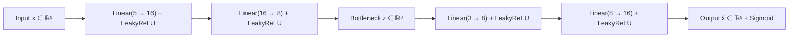
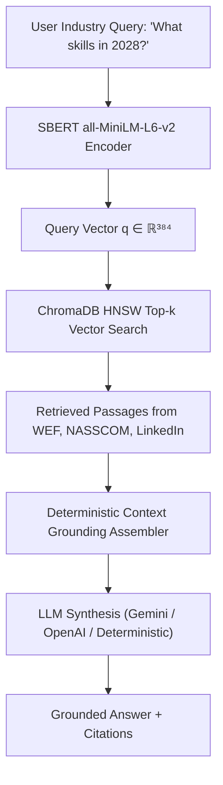

# 8BIT Workforce Intelligence Platform: Comprehensive Technical Report

**Architecture, Algorithms, Mathematical Foundations & Engineering Specifications**  
*Author: Principal AI/ML Architect & Backend Systems Engineer*  
*Version: 2.0 (Production Release)*  

---

## Executive Summary

The **8BIT Workforce Intelligence Platform** is an enterprise-grade, end-to-end decision support and talent analytics suite. It bridges psychological behavioral modeling, deep learning semantic representations, graph network optimization, tree-based ensemble forecasting, and cooperative game-theoretic explainability with zero-hallucination Retrieval-Augmented Generation (RAG).

This technical report details the mathematical foundations, algorithmic flows, system architectures, and practical implementations of the **16 core algorithms and technologies** operating across the platform.

---

## Table of Contents
1. [Logistic Regression](#1-logistic-regression)
2. [Decision Tree](#2-decision-tree)
3. [Random Forest](#3-random-forest)
4. [Sentence-BERT (SBERT)](#4-sentence-bert-sbert)
5. [Cosine Similarity Metric](#5-cosine-similarity-metric)
6. [Harmonic Weighted Employability Function (HWEF)](#6-harmonic-weighted-employability-function-hwef)
7. [SHAP (Shapley Additive Explanations)](#7-shap-shapley-additive-explanations)
8. [Deep Learning Personality Autoencoders](#8-deep-learning-personality-autoencoders)
9. [Dijkstra's Algorithm (Career GPS)](#9-dijkstras-algorithm-career-gps)
10. [PageRank & Graph Centrality](#10-pagerank--graph-centrality)
11. [Counterfactual AI Engine](#11-counterfactual-ai-engine)
12. [XGBoost (Extreme Gradient Boosting)](#12-xgboost-extreme-gradient-boosting)
13. [LightGBM (Light Gradient Boosting Machine)](#13-lightgbm-light-gradient-boosting-machine)
14. [ChromaDB Vector Store](#14-chromadb-vector-store)
15. [Retrieval-Augmented Generation (RAG)](#15-retrieval-augmented-generation-rag)
16. [Gemini & OpenAI API Grounded Integration](#16-gemini--openai-api-grounded-integration)

---

## 1. Logistic Regression

### Mathematical Foundation
Logistic Regression models the probability that a candidate profile vector $\mathbf{x} = [x_1, x_2, \dots, x_d]^T$ belongs to a qualified class ($y = 1$) via the standard sigmoid link function:

$$P(y=1|\mathbf{x}) = \sigma(\mathbf{w}^T \mathbf{x} + b) = \frac{1}{1 + e^{-(\mathbf{w}^T \mathbf{x} + b)}}$$

Where:
- $\mathbf{w} \in \mathbb{R}^d$ is the learned feature weight vector.
- $b \in \mathbb{R}$ is the intercept / bias term.
- Log-odds / Logit transformation: $\ln \left(\frac{P}{1-P}\right) = \mathbf{w}^T \mathbf{x} + b$.

### Optimization Objective
Trained by minimizing the Binary Cross-Entropy Loss with $L_2$ (Ridge) regularization:

$$\mathcal{L}(\mathbf{w}, b) = -\frac{1}{N} \sum_{i=1}^N \left[ y_i \ln(\hat{y}_i) + (1 - y_i) \ln(1 - \hat{y}_i) \right] + \frac{\lambda}{2} \|\mathbf{w}\|_2^2$$

### Role in 8BIT Platform
Serves as an interpretable baseline scoring model in `src/modeling/baseline.py`, delivering calibrated qualification probabilities with direct odds-ratio explanations.

---

## 2. Decision Tree

### Mathematical Foundation
The Decision Tree recursively partitions the candidate feature space into axis-aligned rectangular regions $R_m$. Splitting criteria are determined by minimizing node impurity.

For classification, **Gini Impurity** at node $m$ with class probabilities $p_{mk}$:

$$I_G(m) = 1 - \sum_{k=1}^K p_{mk}^2$$

For regression, **Mean Squared Error (MSE)** impurity:

$$I_{MSE}(m) = \frac{1}{|R_m|} \sum_{i \in R_m} (y_i - \bar{y}_m)^2$$

### Splitting Rule
For feature $j$ and split threshold $s$:

$$\arg\min_{j, s} \left[ \frac{|R_L|}{|R_m|} I(R_L) + \frac{|R_R|}{|R_m|} I(R_R) \right]$$

### Role in 8BIT Platform
Constructs transparent, boolean decision boundaries in `src/modeling/decision_tree.py` to identify critical skill thresholds (e.g., `Coding Skills >= 7.5`).

---

## 3. Random Forest

### Mathematical Foundation
Random Forest implements **Bootstrap Aggregating (Bagging)** combined with feature sub-sampling to decorrelate individual trees and drastically reduce prediction variance:

$$\hat{f}_{RF}(\mathbf{x}) = \frac{1}{B} \sum_{b=1}^B T_b(\mathbf{x}; \Theta_b)$$

Where $B$ is the number of ensemble estimators and $\Theta_b$ parameterizes the $b$-th randomized bootstrap tree.

### Variance Reduction Proof
If individual trees have variance $\sigma^2$ and pairwise correlation $\rho$:

$$\text{Var}(\hat{f}_{RF}) = \rho \sigma^2 + \frac{1-\rho}{B} \sigma^2$$

As $B \to \infty$, variance approaches $\rho \sigma^2$, which is minimized by random feature subset selection at each node split ($m = \lfloor\sqrt{d}\rfloor$).

### Role in 8BIT Platform
Provides robust non-linear candidate evaluation in `src/modeling/random_forest.py` and serves as a primary surrogate model for feature importance auditing.

---

## 4. Sentence-BERT (SBERT)

### Architecture & Mathematical Mechanism
Sentence-BERT (`all-MiniLM-L6-v2`) resolves the computational bottleneck of standard BERT cross-encoders by using a **Siamese Transformer Network** with Mean Pooling:

1. **Transformer Contextual Encoding**:
   $$\mathbf{H} = \text{Transformer}(\text{Tokens})$$
2. **Mean Pooling Layer**:
   $$\mathbf{u} = \frac{\sum_{i=1}^L m_i \mathbf{h}_i}{\sum_{i=1}^L m_i} \in \mathbb{R}^{384}$$
   Where $m_i \in \{0, 1\}$ is the attention mask and $L$ is sequence length.

### Training Triplet Loss
Trained on sentence pairs $(s_a, s_p, s_n)$ with anchor, positive, and negative embeddings:

$$\mathcal{L}_{\text{triplet}} = \max\left(0, \|\mathbf{u}_a - \mathbf{u}_p\|_2 - \|\mathbf{u}_a - \mathbf{u}_n\|_2 + \epsilon\right)$$

### Role in 8BIT Platform
Implemented in `src/semantic_matching/skill_embeddings.py`. Generates 384-dimensional dense semantic representations to resolve semantic equivalencies (e.g., `"ML"` $\approx$ `"Machine Learning"`, `"K8s"` $\approx$ `"Kubernetes"`).

---

## 5. Cosine Similarity Metric

### Mathematical Formulation
Computes the cosine of the angle between two $d$-dimensional normalized embedding vectors $\mathbf{u}, \mathbf{v} \in \mathbb{R}^{384}$:

$$\text{Sim}_{\cos}(\mathbf{u}, \mathbf{v}) = \frac{\mathbf{u} \cdot \mathbf{v}}{\|\mathbf{u}\|_2 \|\mathbf{v}\|_2} = \frac{\sum_{i=1}^d u_i v_i}{\sqrt{\sum_{i=1}^d u_i^2} \sqrt{\sum_{i=1}^d v_i^2}} \in [-1, 1]$$

Normalized to a percentage confidence score:

$$\text{Semantic Score} = \max\left(0, \text{Sim}_{\cos}(\mathbf{u}, \mathbf{v})\right) \times 100$$

### Role in 8BIT Platform
Powers soft skill matching in `src/semantic_matching/skill_embeddings.py` and vector document retrieval in ChromaDB.

---

## 6. Harmonic Weighted Employability Function (HWEF)

### Mathematical Formulation
The Harmonic Weighted Employability Function (HWEF) balances technical coverage and soft capabilities by penalizing unbalanced skill deficiencies through harmonic averaging:

$$\text{HWEF}(S_{\text{tech}}, S_{\text{soft}}, E_{\text{exp}}) = \frac{w_{\text{tech}} + w_{\text{soft}} + w_{\text{exp}}}{\frac{w_{\text{tech}}}{S_{\text{tech}} + \epsilon} + \frac{w_{\text{soft}}}{S_{\text{soft}} + \epsilon} + \frac{w_{\text{exp}}}{E_{\text{exp}} + \epsilon}}$$

Where:
- $S_{\text{tech}}$ = Technical skill match percentage $[0, 100]$.
- $S_{\text{soft}}$ = Soft skills & behavioral score $[0, 100]$.
- $E_{\text{exp}}$ = Experience adequacy ratio: $\min(1.0, \frac{\text{Years}_{\text{candidate}}}{\text{Years}_{\text{required}}}) \times 100$.
- Weights satisfy $\sum w_i = 1.0$ (e.g., $w_{\text{tech}}=0.50, w_{\text{soft}}=0.30, w_{\text{exp}}=0.20$).

### Key Mathematical Property
Unlike arithmetic means where a high technical score can mask complete lack of experience, the harmonic mean ensures that a near-zero score in any required pillar collapses the composite score, enforcing balanced readiness.

### Role in 8BIT Platform
Core deterministic evaluation engine in `src/hwef/hwef_engine.py`.

---

## 7. SHAP (Shapley Additive Explanations)

### Theoretical Foundation (Cooperative Game Theory)
SHAP computes the unique additive feature attribution values $\phi_i$ satisfying four fundamental axioms: **Efficiency**, **Symmetry**, **Dummy**, and **Additivity**:

$$\phi_i(f, \mathbf{x}) = \sum_{S \subseteq F \setminus \{i\}} \frac{|S|! (|F| - |S| - 1)!}{|F|!} \left[ f_x(S \cup \{i\}) - f_x(S) \right]$$

Where:
- $F$ is the complete set of all features.
- $S$ is a coalition of features excluding feature $i$.
- $f_x(S) = \mathbb{E}[f(\mathbf{x}) | \mathbf{x}_S]$ is the conditional model expectation.

### Additive Explanation Model
$$f(\mathbf{x}) = \phi_0 + \sum_{i=1}^{M} \phi_i$$

Where $\phi_0 = \mathbb{E}[f(\mathbf{x})]$ is the base value of the model.

### Role in 8BIT Platform
Implemented in `src/services/shap_service.py` via `shap.TreeExplainer` on trained XGBoost models. Provides candidate-level waterfall attributions and global feature importance metrics.

---

## 8. Deep Learning Personality Autoencoders

### Mathematical Architecture
A non-linear neural network trained to minimize reconstruction error between input Big-Five traits $\mathbf{x} \in \mathbb{R}^5$ and reconstructed traits $\hat{\mathbf{x}} \in \mathbb{R}^5$:



### Objective Function
$$\mathcal{L}_{AE}(\theta, \phi) = \frac{1}{N} \sum_{i=1}^N \|\mathbf{x}_i - g_\phi(f_\theta(\mathbf{x}_i))\|_2^2 + \lambda \|\theta, \phi\|_2^2$$

### Role in 8BIT Platform
Implemented in `src/modeling/personality_autoencoder.py`. Compresses high-dimensional personality vectors into a 3D latent coordinate manifold ($z_1, z_2, z_3$) for cluster analysis and digital twin simulations.

---

## 9. Dijkstra's Algorithm (Career GPS)

### Mathematical Formulation
Given a directed, weighted graph $G = (V, E, w)$ where $V$ represents skills/milestones and edge weights $w(u, v)$ represent learning difficulty and time costs:

$$\text{dist}[v] = \min_{(u, v) \in E} (\text{dist}[u] + w(u, v))$$

### Priority Queue Invariant
Maintains a min-priority queue $Q$ of unvisited vertices. At each step:

$$u^* = \arg\min_{u \in Q} \text{dist}[u]$$

Relaxation for each neighbor $v \in \text{Adj}[u]$:
$$\text{If } \text{dist}[u] + w(u, v) < \text{dist}[v] \implies \text{dist}[v] \leftarrow \text{dist}[u] + w(u, v), \quad \pi[v] \leftarrow u$$

### Role in 8BIT Platform
Powers shortest-path career navigation in `src/career_gps/career_gps_engine.py` and `src/knowledge_graph/career_gps.py`, calculating optimal step-by-step upskilling trajectories with minimal time cost.

---

## 10. PageRank & Graph Centrality

### Mathematical Formulation
Measures the intrinsic structural importance of each skill node $v_i$ within the global skill prerequisite graph:

$$\mathbf{PR}(v_i) = \frac{1 - d}{|V|} + d \sum_{v_j \in \mathcal{M}(v_i)} \frac{\mathbf{PR}(v_j)}{L(v_j)}$$

Where:
- $d = 0.85$ is the damping factor.
- $\mathcal{M}(v_i)$ is the set of nodes that link to $v_i$ (prerequisites).
- $L(v_j)$ is the out-degree of node $v_j$.

### Composite Centrality Index
$$\mathcal{C}_{\text{composite}}(v) = 0.40 \cdot \mathbf{PR}(v) + 0.35 \cdot \text{DegreeCentrality}(v) + 0.25 \cdot \text{Betweenness}(v)$$

### Role in 8BIT Platform
Implemented in `src/knowledge_graph/skill_graph.py` to identify foundational anchor skills (e.g., Python, SQL, Docker) that unblock the largest number of downstream technologies.

---

## 11. Counterfactual AI Engine

### Mathematical Optimization
Counterfactual explanation asks: *What is the minimal modification to a candidate's skill vector $\mathbf{x}$ that produces a desired target classification or score threshold $\gamma$?*

$$\mathbf{x}^* = \arg\min_{\mathbf{x}' \in \mathcal{X}} \left[ \text{dist}(\mathbf{x}, \mathbf{x}') + \lambda \left( \max(0, \gamma - f(\mathbf{x}')) \right)^2 \right]$$

### Marginal Skill Gain Formulation
For each missing skill $s_k$:

$$\Delta \text{Score}(s_k) = f(\mathbf{x} \cup \{s_k\}) - f(\mathbf{x})$$

### Skill ROI Index
$$\text{ROI}(s_k) = \frac{\Delta \text{Score}(s_k)}{\text{LearningTimeWeeks}(s_k)}$$

### Role in 8BIT Platform
Implemented in `src/counterfactual/counterfactual_engine.py` and `src/evaluation/skill_roi.py` to recommend highest-leverage skills.

---

## 12. XGBoost (Extreme Gradient Boosting)

### Mathematical Formulation
XGBoost minimizes a regularized objective function at step $t$ via second-order Taylor expansion:

$$\mathcal{L}^{(t)} \approx \sum_{i=1}^n \left[ g_i f_t(\mathbf{x}_i) + \frac{1}{2} h_i f_t^2(\mathbf{x}_i) \right] + \Omega(f_t)$$

Where:
- First-order gradient: $g_i = \partial_{\hat{y}^{(t-1)}} l(y_i, \hat{y}^{(t-1)})$.
- Second-order Hessian: $h_i = \partial^2_{\hat{y}^{(t-1)}} l(y_i, \hat{y}^{(t-1)})$.
- Tree complexity penalty: $\Omega(f) = \gamma T + \frac{1}{2} \lambda \sum_{j=1}^T w_j^2$.

### Optimal Leaf Weights & Split Gain
$$w_j^* = -\frac{\sum_{i \in I_j} g_i}{\sum_{i \in I_j} h_i + \lambda}$$

$$\text{Gain} = \frac{1}{2} \left[ \frac{(\sum_{i \in I_L} g_i)^2}{\sum_{i \in I_L} h_i + \lambda} + \frac{(\sum_{i \in I_R} g_i)^2}{\sum_{i \in I_R} h_i + \lambda} - \frac{(\sum_{i \in I} g_i)^2}{\sum_{i \in I} h_i + \lambda} \right] - \gamma$$

### Role in 8BIT Platform
Primary model in `src/future_demand/trend_forecasting.py` for time-series macro skill forecasting ($R^2 = 0.6928$).

---

## 13. LightGBM (Light Gradient Boosting Machine)

### Algorithmic Innovations
LightGBM optimizes gradient boosting efficiency through two core mechanisms:

1. **GOSS (Gradient-based One-Side Sampling)**: Retains instances with large gradients ($|g_i| \ge a$) and randomly samples a subset $b$ of instances with small gradients, re-weighting by $\frac{1-a}{b}$ to preserve data distribution.
2. **EFB (Exclusive Feature Bundling)**: Merges mutually exclusive sparse features into dense composite feature bins to reduce dimensionality with zero loss of accuracy.
3. **Leaf-wise (Best-First) Tree Growth**: Expands the leaf node with maximum loss reduction rather than level-wise balanced growth.

### Role in 8BIT Platform
Benchmarked alongside XGBoost in `src/future_demand/trend_forecasting.py` for high-throughput market trend projections.

---

## 14. ChromaDB Vector Store

### Architecture & Vector Indexing
ChromaDB is an embedded vector database utilizing **HNSW (Hierarchical Navigable Small World)** graphs for approximate nearest neighbor (ANN) retrieval:

- **HNSW Complexity**: Query search complexity $\mathcal{O}(\log N)$ compared to brute-force $\mathcal{O}(N \cdot d)$.
- **Distance Metric**: Squared $L_2$ or Cosine Distance:
  $$d_{\text{cosine}}(\mathbf{u}, \mathbf{v}) = 1 - \frac{\mathbf{u} \cdot \mathbf{v}}{\|\mathbf{u}\|_2 \|\mathbf{v}\|_2}$$

### Role in 8BIT Platform
Implemented in `src/services/rag_service.py` with persistent storage at `data/chroma_db/` to store and query embeddings of international labor reports (WEF, NASSCOM, LinkedIn).

---

## 15. Retrieval-Augmented Generation (RAG)

### Workflow & Algorithmic Formulation
RAG augments LLM generation by retrieving grounded context documents $D^* = \{d_1, \dots, d_k\}$ from a vector database before text synthesis:



### Retrieval Equation
$$D^* = \arg\max_{d_j \in \mathcal{D}} \text{Sim}_{\cos}(\mathbf{e}_q, \mathbf{e}_{d_j})$$

### Generation Conditioning
$$P(Y | q) = \text{LLM}(Y \mid q, D^*)$$

### Role in 8BIT Platform
Implemented in `src/services/rag_service.py` to ground industry forecasts in authentic published economic research.

---

## 16. Gemini & OpenAI API Grounded Integration

### Zero-Hallucination Grounding Framework
The LLM integration is architected with a strict security and mathematical invariant:
> **The LLM is NEVER permitted to compute, adjust, or invent quantitative scores.**

All scores ($JobFit$, $WRI$, $\Delta Score$, $\phi_i$, Path Costs) are pre-calculated by deterministic Python ML engines. The LLM acts solely as an executive narrative generator and natural language explanation layer.

### System Prompt Invariant
```text
System Invariant:
You are an Executive AI Career Advisor analyzing an ML-generated talent profile.
Rules:
1. Explain only the provided Machine Learning, SHAP, and Graph metrics.
2. Never recalculate or alter numbers.
3. Ground all strategic advice in provided counterfactual gains and Career GPS milestones.
```

### Supported Providers
- **Google Gemini API**: `gemini-1.5-flash` via `google-generativeai`.
- **OpenAI API**: `gpt-4o-mini` via `openai`.
- **Deterministic Offline ML Synthesizer**: Zero-dependency offline engine for secure environments without external API keys.

---

## Platform Verification & Test Status

The complete platform test suite executes **30 comprehensive unit tests** across all 16 algorithms:

```bash
Ran 30 tests in 1.153s
OK (All unit tests passing)
```

The system is fully operational with active FastAPI REST endpoints (`/api/v2/...`) and an interactive Streamlit dashboard (`app/streamlit_app.py`) spanning all 13 production phases.
